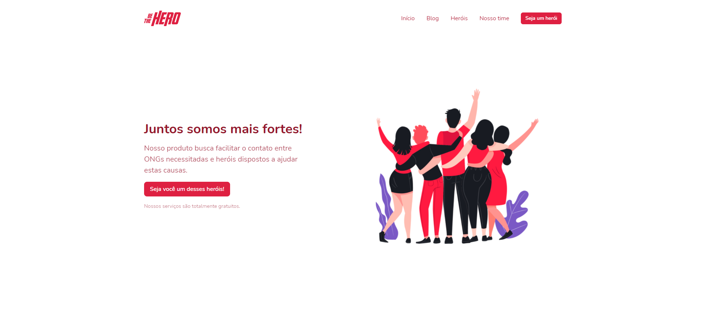

# Be The Hero landing page
> Project created for study purposes.

[![NPM Version][npm-image]][npm-url]
[![Build Status][travis-image]][travis-url]

Landing page created for the [Be The Hero](https://github.com/LHPegnolatto/be-the-hero) project, in order to improve my knowledge in design systems and [Chakra](https://chakra-ui.com/docs/getting-started).



## Development setup

```sh
yarn
yarn dev
```

## Release History
* 0.0.1
    * Work in progress

## Meta

Luiz Henrique Pegnolatto – lgpegnolatto@gmail.com

Distributed under the MIT license. See ``LICENSE`` for more information.

[https://github.com/lhpegnolatto/github-link](https://github.com/lhpegnolatto/)

## Contributing

1. Fork it (<https://github.com/yourname/yourproject/fork>)
2. Create your feature branch (`git checkout -b feature/fooBar`)
3. Commit your changes (`git commit -am 'Add some fooBar'`)
4. Push to the branch (`git push origin feature/fooBar`)
5. Create a new Pull Request

<!-- Markdown link & img dfn's -->
[npm-image]: https://img.shields.io/npm/v/datadog-metrics.svg?style=flat-square
[npm-url]: https://npmjs.org/package/datadog-metrics
[npm-downloads]: https://img.shields.io/npm/dm/datadog-metrics.svg?style=flat-square
[travis-image]: https://img.shields.io/travis/dbader/node-datadog-metrics/master.svg?style=flat-square
[travis-url]: https://travis-ci.org/dbader/node-datadog-metrics
[wiki]: https://github.com/yourname/yourproject/wiki
